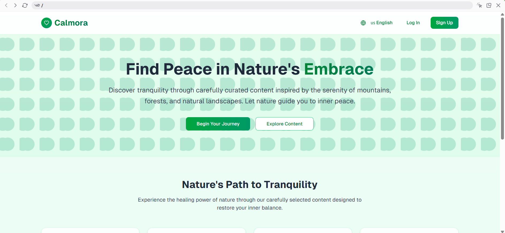
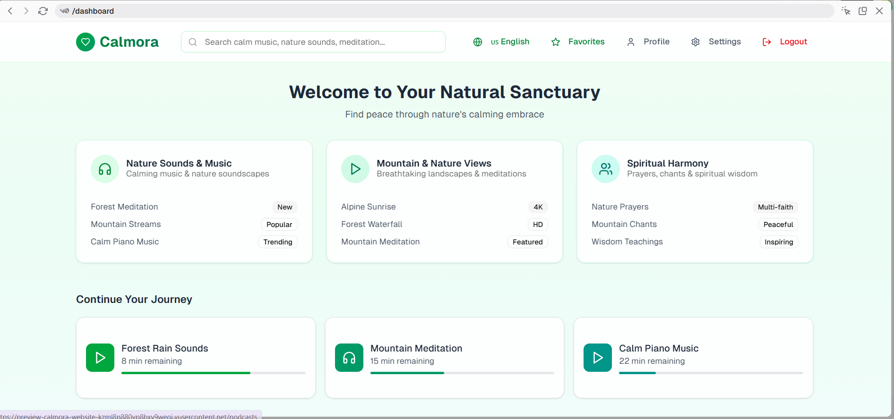
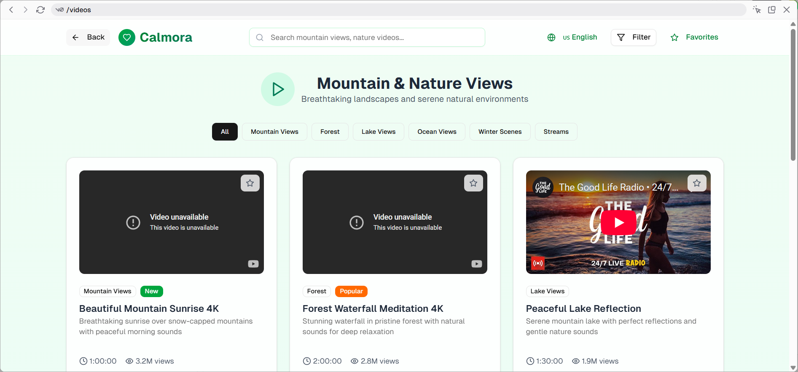
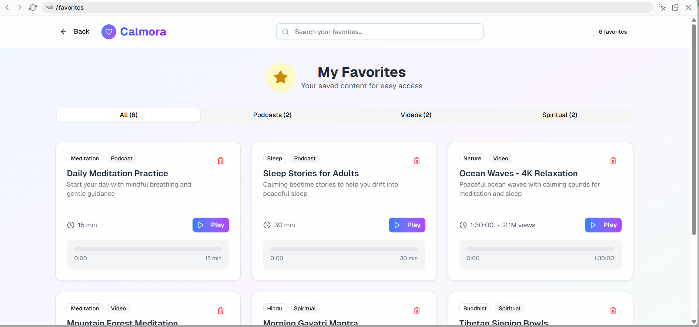
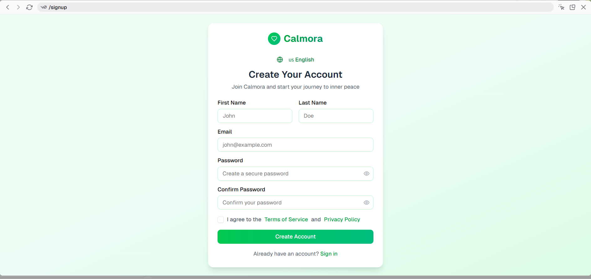

# 🌿 Calmora – Your Calm Space Online

Calmora is a peaceful, user-friendly platform designed to help people relax and reconnect through nature-inspired sounds, spiritual videos, and soft visuals.

---

## 🌟 Features

- 🎧 Listen to calming music & nature sounds
- 🎥 Watch peaceful videos (rain, ocean, mountains)
- 🛕 Explore spiritual content across multiple faiths
- ⭐ Save favorites to your personal list
- 🌍 Switch languages easily
- 📱 Fully responsive design (mobile, tablet, desktop)
- 🔎 Smart search for “calm music”, “spiritual chant”, etc.

---

## 📸 Screenshots

### 🌿 Homepage


### 🎧 Music & Podcasts


### 🎥 Video Gallery


### 🛕 Spiritual Content


### ⭐ Favorites Page


> 🔁 Add your actual images in the `/screenshots/` folder with matching filenames.

---

## 🚀 How to Run Locally

```bash
git clone https://github.com/your-username/calmora.git
cd calmora
npm install
npm run dev
```

---

## 🙏 About Calmora

> 🎧 Listen to calm. 🌿 Feel the peace.  
> A digital sanctuary with soothing music, nature videos, and spiritual wisdom.

---

## 📄 License

This project is licensed under the MIT License.

---

**Made with love for peace and mindfulness.**

